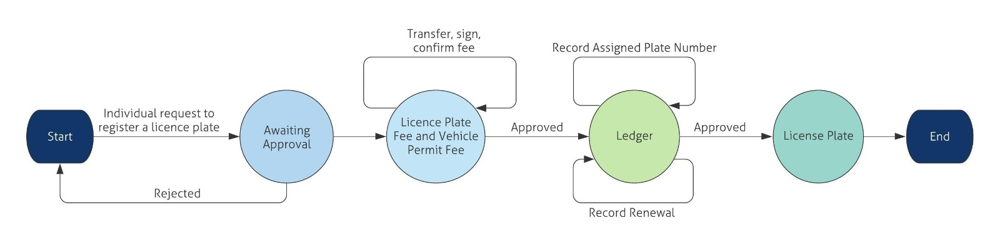

# Dapp1 – Vehicle Plate Registry System 

Hennadii Ahanesian | Neraj obla kumarbabu | Patterson Thamba | Muzammil. | Shafin Rizvi | Feiya Wang | Vidyavathy Venkataseshadri

The authority such as Governments issue license plates to people to keep track of who owns a vehicle. In general multiple parties need to access this information, such as Car dealers, insurance companies and the police. 
For this project, we use Hyperledger Fabric Blockchain to build a system for issuing plates. 

The blockchain would enable:
- Gathering vehicle information
- Gather plate owner information
- Record payment for license
- Record assigned plate number
- Record plate renewal data
- Call to find owner and vehicle information by plate

## State Diagram

----

## Model: 

States
- No License plate - Ledger - License Plate approved

State data
- States: [“No Plate”, “Ledger”, “License Plate”]
- State: 0
- Car model:
- Car owner name: 
- Car Company: “”
- Record date:

---

### Roles

| Role                                         | Type/Organisation  |  
| ---------------------------------------------| -------------------|  
| Owner                                        |  client , org1     |                                                
| Government/issuer                            |  admin , org2      |                                              
| car dealer                                   |  admin , org1      |  
| insurance                                    |  admin , org1      |  
| police                                       |  admin , org2      |  

---

### Functions 

| Functions                                    | Access               | State Transition 	                                           |
| ---------------------------------------------| ---------------------|----------------------------------------------------------------|  
| initLedger                                   | internal             | state change [putState] { issueStatus : "unissued" }           |              
| checkPlate                                   | external             | on fail : state change [putState] { issueStatus : "rejected"}  |
|                                              |                      | on success : call createPlate                                  |
| createPlate                                  | internal             | state change [putState] { issueStatus : "issued" }  	       |
| renewPlate                                   | external             | state change [putState] { issueStatus : "renewed" } 	       |
| getPlate                                     | external             | no state change [getState]				                       |

---

## How to Run
This project is done using Google Cloud Platform VM Instance

Make sure to clone the Hyperfabric Fabric Samples as it is required to setup a test network with /bin and /config folders

Copy the following commands to setup the network , inside the /fabric-samples folder
	
	git clone https://github.com/pattersonthamba/PlateRegistry-DApp
	cp -R ./PlateRegistry-DApp/platechain/ ./
	cp -R ./PlateRegistry-DApp/chaincode/ ./
	cp -R ./PlateRegistry-DApp/test-network/ ./
	cd chaincode/platechain/javascript/
	npm install
	cd ../../../
	cd platechain/
	./networkDown.sh 
	./startFabric.sh  javascript
	
This will setup the hyperledger fabric network where 'platechain' chaincode are installed on org1 and org2

We need two seperate VM Instances for backend and frontend

For backend server setup , copy the following the commands [current directory : /fabric-samples/platechain/]

	cd express-backend/
	npm install
	node enrollAdmin.js 
	node registerUser.js
	node backend.js 
	
The backend server will start run on port 4001

Before setting the frontend server , make sure to do the following changes [current directory : /fabric-samples/platechain/]

		Go to App.js which is inside [/react-frontend/src] and change the YOUR_EXTERNAL_IP value with your VM Instance External IP Address
		
			constructor() {
				super()
				this.state = {
					showFeed: false,
					connected: false,
					socket : socketIOClient("http://[YOUR_EXTERNAL_IP]:4001/"),
					blocks : [],
				}
				this.switchFeedHandler = this.switchFeedHandler.bind(this);
			}

This will connect to the backend server and make sure the connection is only 'http'
	
After changing the value, copy the following the commands to setup frontend server [current directory : /fabric-samples/platechain/]

	cd react-frontend/
	npm install
	npm start
	
The backend server will start run on port 3000

Both servers can be used with YOUR_EXTERNAL_IP value ,so it will be

		Backend server : http://[YOUR_EXTERNAL_IP]:4001/
		Frontend server : http://[YOUR_EXTERNAL_IP]:3000/

Note : If you are not able to access the server outside the instance , check the firewall rules for VM Instance to allow these ports 4001 and 3000.

Thank you for your time.

---

## Resources
BLOCKCHAIN NETWORK
1. Hyperledger fabric samples(test-network is used).
2. Fabric node SDK
3. Docker

BACKEND
1. Fabric network
2. Express
3. Socket.io

FRONTEND
1. React
2. Socket.io client
